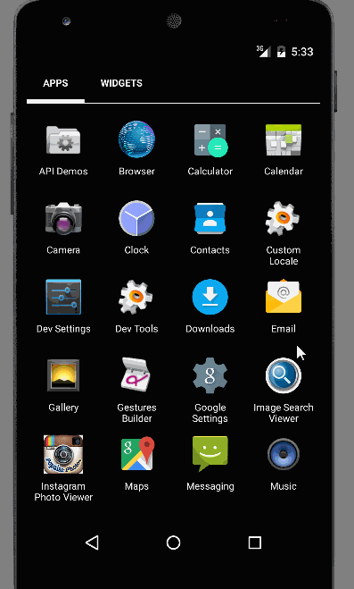

Android Bootcamp Week 3 Project 3 - Simple Twitter Client

Simple Twitter client that supports viewing a Twitter timeline

User Stories:

The following user stories must be completed:

* [x] User can sign in to Twitter using OAuth login
* [x] User can view the tweets from their home timeline
* [x] User should be displayed the username, name, and body for each tweet
* [ ] User should be displayed the relative timestamp for each tweet "8m", "7h"
* [x] User can view more tweets as they scroll with infinite pagination
* [ ] User can compose a new tweet
* [ ] User can click a “Compose” icon in the Action Bar on the top right
* [ ] User can then enter a new tweet and post this to twitter
* [ ] User is taken back to home timeline with new tweet visible in timeline

Still work in progress, more will be added as soon!

GIF created with [LiceCap](http://www.cockos.com/licecap/).

Total Time spent: 5 hours

